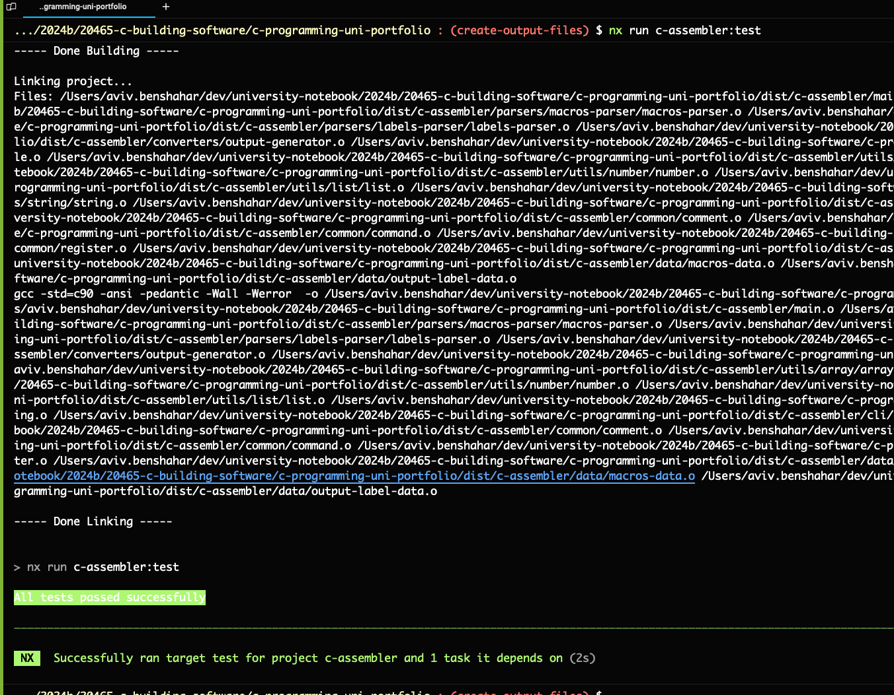
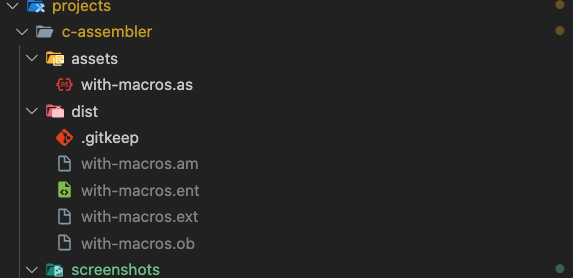

# `C Assembler`

[](https://trello.com/b/LkRTtcwC/trello-agile-sprint-board-template)

## Description

This project is a simple assembler written in C. It reads a file with assembly code and translates it into machine code.

## Compilation

### With Nx

-   Run `npx nx run c-assembler:build`

### With Make

-   Run `make -C {projectRoot}/src/ target='$(PWD)/dist/c-assembler' name=c-assembler`

## Run with arguments

```bash
nx run c-assembler:run --args="--input projects/c-assembler/assets/with-macros"
```

## Testing

### Manual Testing

-   Run `npx nx run c-assembler:run`
-   Enter the path to the file with assembly code, for example `--args="--input projects/c-assembler/assets/with-macros"`

### With `NodeJS` test-bed:

-   Run `npx nx run c-assembler:test`
-   See results in the console

## Screenshots




