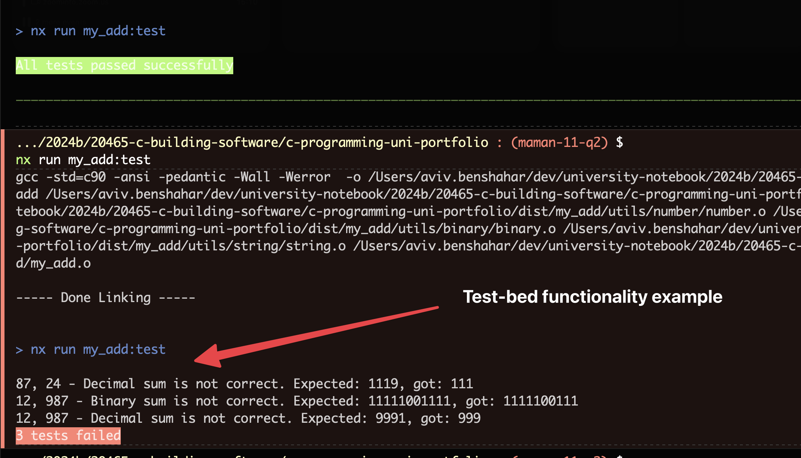
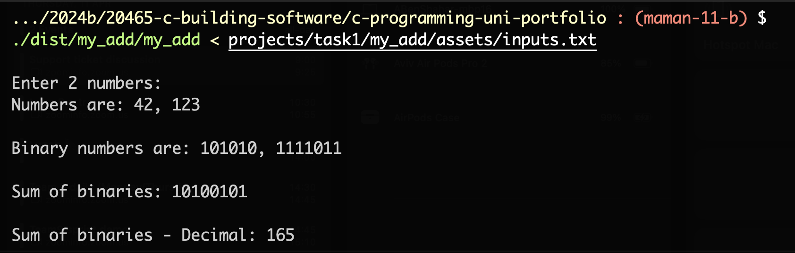
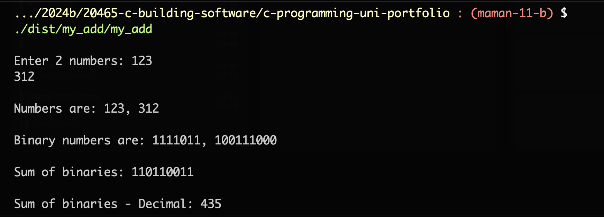

# `my_add` Functionality

## Description

This function takes two numbers as input and returns their sum.

The entire calculation is done in the `my_add` function, with a binary form of each number.

## Testing

### Manual Testing

-   Run `npx nx run my_add:run`
-   Enter two decimal numbers, for example `123 312`
-   See results in the console

### With `inputs.txt` file:

-   Run `npx nx run my_add:build`
-   Run `./dist/my_add/my_add < projects/task1/my_add/assets/inputs.txt`

### With `NodeJS` test-bed:

-   Run `./projects/task1/my_add/testing/test-bed.js`
-   See results in the console

## Process

-   The program expect to get 2 decimal numbers
-   Print the numbers
-   Turn the numbers into binary
-   Print the binary numbers
-   Add the binary numbers
-   Print the sum in binary form
-   Print the sum in decimal form

## Screenshots

