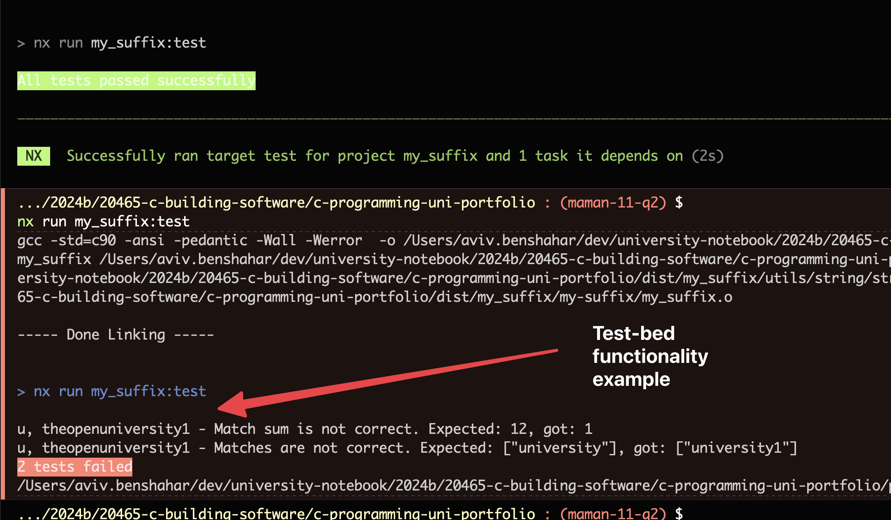
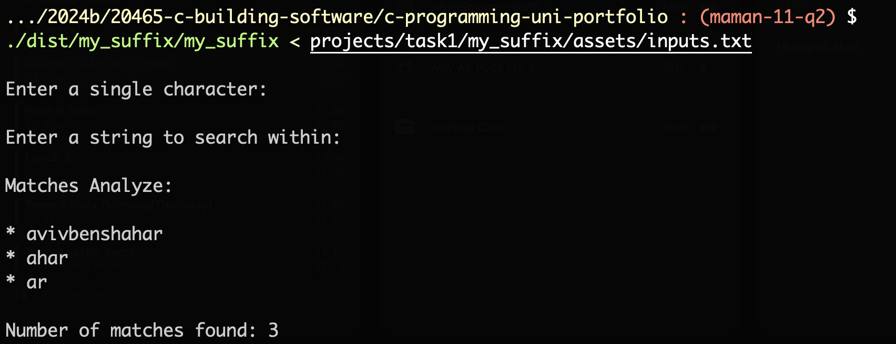
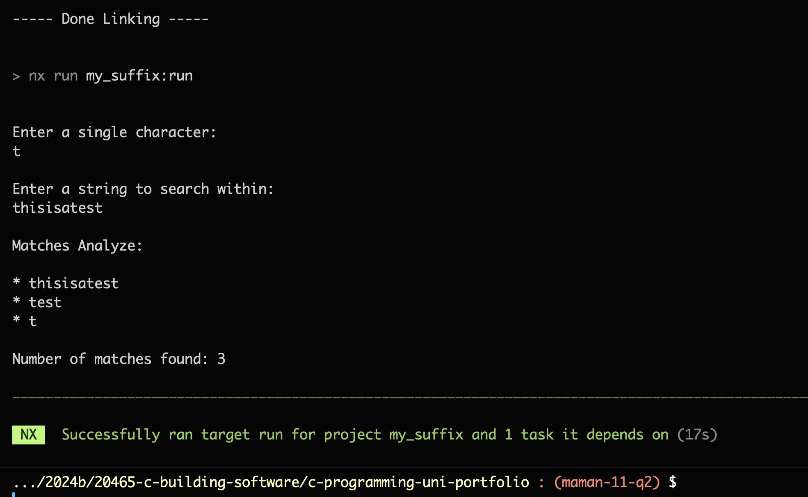

# `my_suffix` Functionality

## Description

This function takes a string and a character, prints all suffixes of the string that start with the character, and return the number of suffixes.

## Compilation

### With Nx

-   Run `npx nx run my_suffix:build`

### With Make

-   Run `make -C {projectRoot}/src/ target='$(PWD)/dist/my_suffix' name=my_suffix`

## Testing

### Manual Testing

-   Run `npx nx run my_suffix:run`
-   Enter a character, for example `a`
-   Enter a string, for example `abc`
-   See results in the console

### With `inputs.txt` file:

-   Run `npx nx run my_suffix:build`
-   Run `./dist/my_suffix/my_suffix < projects/task1/my_suffix/assets/inputs.txt`

### With `NodeJS` test-bed:

-   Run `npx nx run my_suffix:test`
-   See results in the console

## Process

-   The program expect to get a character and a string
-   Print all suffixes of the string that start with the character
-   Return the number of suffixes
-   Print the number of suffixes

## Screenshots

