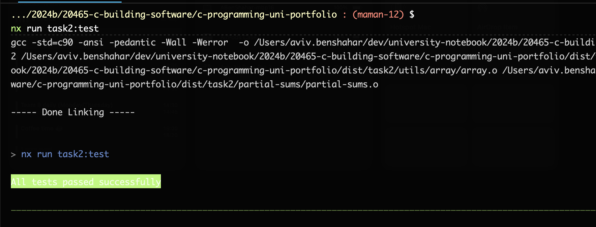
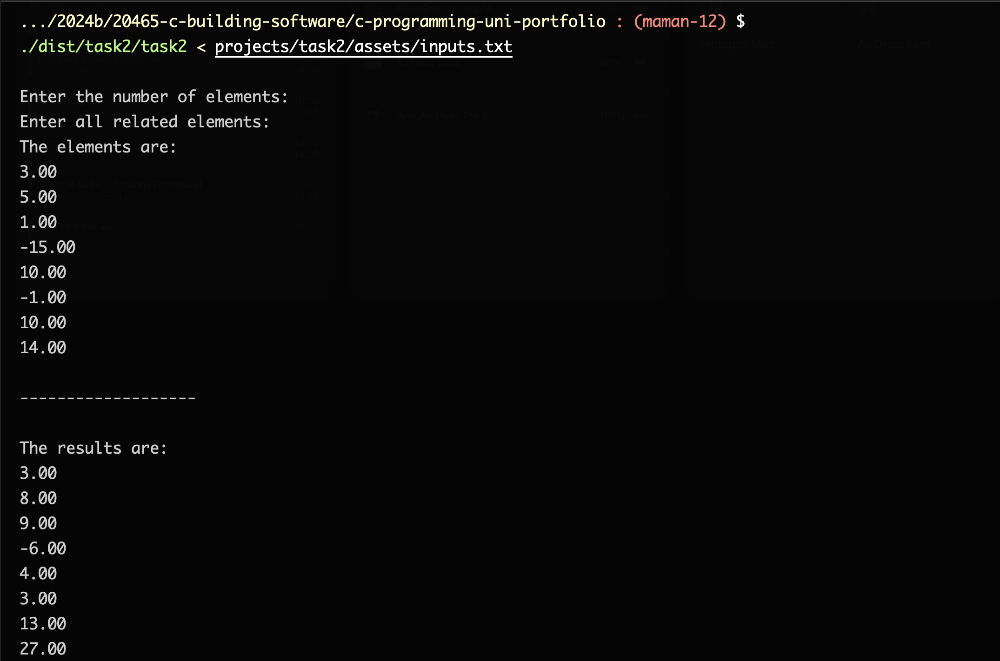
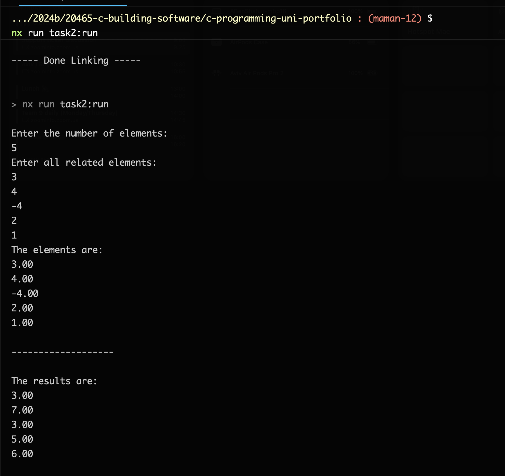

# `partial-sums` Functionality

## Description

This function takes an array length & array of doubles with the same length, and returns a n array that contain the sum from the array beginning to the current index.

## Testing

### Manual Testing

-   Run `npx nx run task2:run`
-   Enter the array length, for example `3`
-   Enter 3 doubles, for example `1 2 3`
-   See results in the console

### With `inputs.txt` file:

-   Run `npx nx run task2:build`
-   Run `./dist/task2/task2 < projects/task2/assets/inputs.txt`

### With `NodeJS` test-bed:

-   Run `npx nx run task2:test`
-   See results in the console

## Process

-   The program expect to get a length of an array
-   The program expect to get an array of doubles
-   Print all inputs
-   Calculate the partial sums
-   Print the partial sums

## Screenshots

